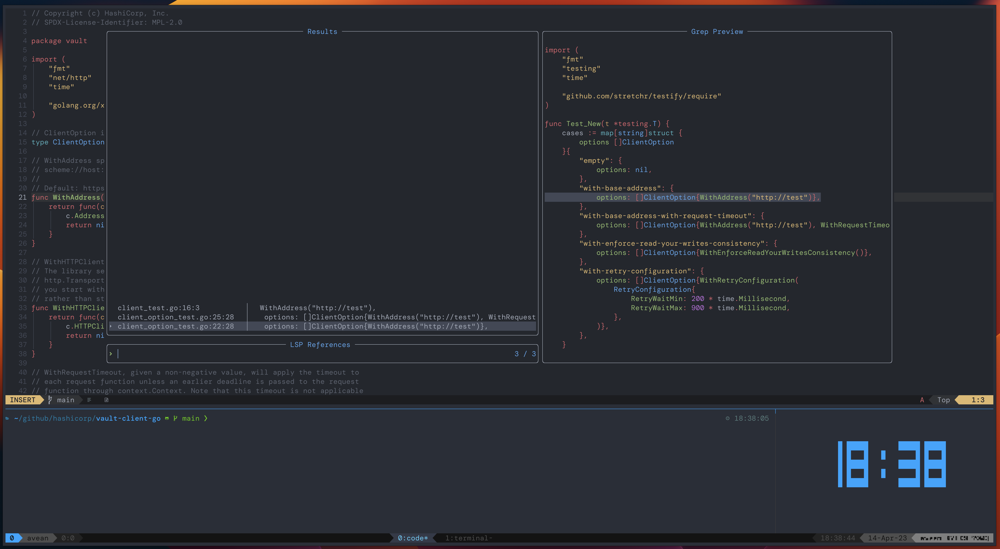

# My dev environment

A collection of configuration files for my macbook:

- Editor: [neovim](https://neovim.io/)
  - [LazyVim](https://github.com/LazyVim/LazyVim) ([config](dotfiles/.config/nvim))
- Shell: [zsh](https://en.wikipedia.org/wiki/Z_shell) ([.zshrc](dotfiles/.zshrc))
  - [oh my zsh](https://ohmyz.sh/) + [Powerlevel10k](https://github.com/romkatv/powerlevel10k) ([config](dotfiles/.p10k.zsh))
  - [fzf](https://github.com/junegunn/fzf) ([config](dotfiles/.fzf.zsh))
- Terminal emulators:
  - [alacritty](https://alacritty.org/) ([config](dotfiles/.config/alacritty/))
  - [kitty](https://sw.kovidgoyal.net/kitty/) ([config](dotfiles/.config/kitty/))
- Terminal multiplexer: [tmux](https://en.wikipedia.org/wiki/Tmux) ([config](dotfiles/.tmux.conf))
  - [tpm](https://github.com/tmux-plugins/tpm) ([config](dotfiles/.tmux/plugins/))
  - [jimeh/tmux-themepack](https://github.com/jimeh/tmux-themepack) ([config](dotfiles/.tmux/plugins/))



# Installation

```shell-session
./install.sh
```

This script uses [`stow`](https://www.gnu.org/software/stow/) to create
symlinks to the corresponding files in the home directory.

